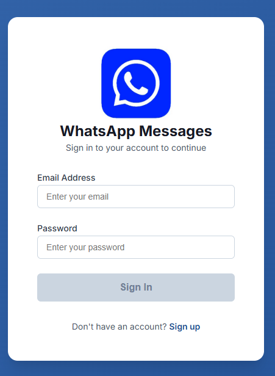
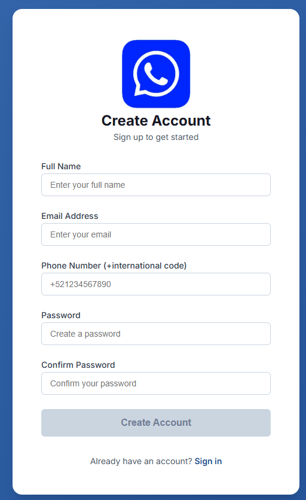
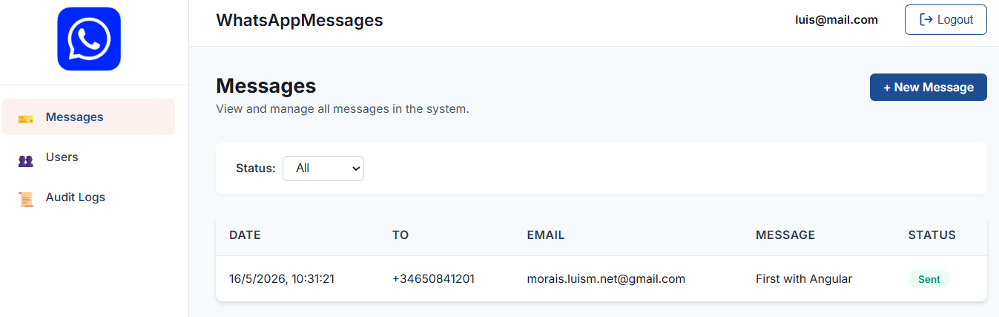
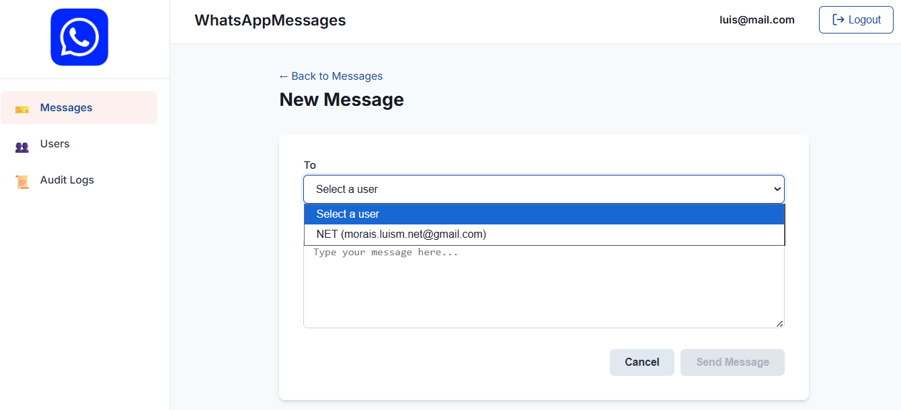
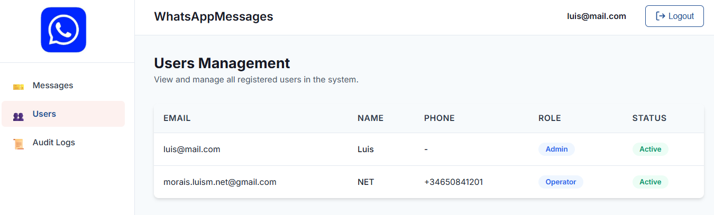
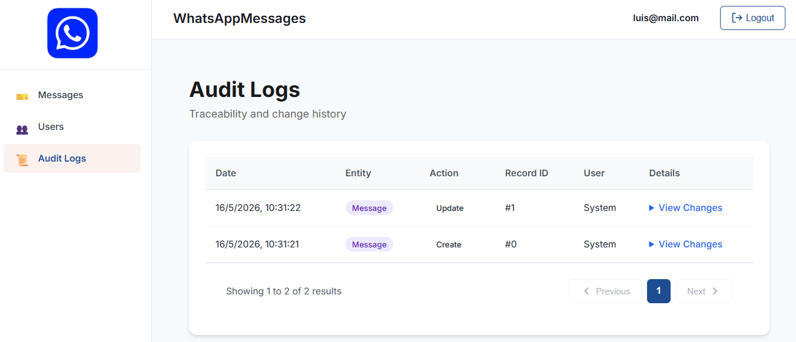
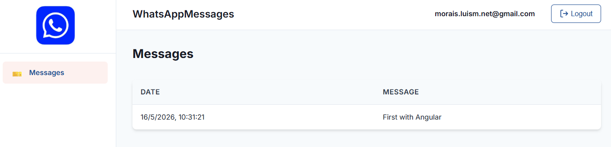

# WhatsAppMessagesAngular

Angular 20 frontend for the WhatsAppMessages system.

## Features

- **Authentication**: JWT-based login and registration
- **Messages Management**: Full CRUD operations with filtering
- **Modern UI**: Clean, professional design with responsive layout

## Prerequisites

- Node.js 18+ and npm
- Angular CLI 20

## Installation

```bash
npm install
```

## Development Server

```bash
npm start
```

Navigate to `http://localhost:4200/`. The application will automatically reload if you change any of the source files.

## Build

```bash
npm run build
```

The build artifacts will be stored in the `dist/` directory.

## Project Structure

```
src/
├── app/
│   ├── core/              # Core services, models, guards, interceptors
│   ├── features/          # Feature modules (auth, messages, etc.)
│   ├── shared/            # Shared components and layouts
│   └── app.config.ts      # Application configuration
├── environments/          # Environment configurations
└── styles.scss           # Global styles
```

## Technologies

- Angular 20 (Standalone Components)
- TypeScript 5.8
- RxJS 7.8
- CSS

## API Configuration

Update the API URL in `src/environments/environment.ts`:

```typescript
export const environment = {
  production: false,
  apiUrl: 'http://localhost:5034/api'
};
```

## Backend

The backend for this project is [WhatsAppMessagesApiNet](https://github.com/moraisLuismNet/WhatsAppMessagesApiNet).

## 📸 Screenshots

| | | |
| :---: | :---: | :---: |
| <kbd></kbd> | <kbd></kbd> | <kbd></kbd> |
| <kbd></kbd> | <kbd></kbd> | <kbd></kbd> |
| <kbd></kbd> 

[DeepWiki moraisLuismNet/WhatsAppMessagesAngular](https://deepwiki.com/moraisLuismNet/WhatsAppMessagesAngular)
